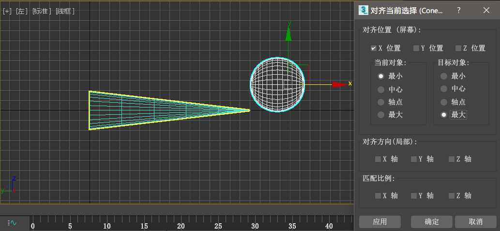

# 第二章 基础知识

## 软件安装、启动及初步使用

安装启动过程略去。

### 三维物体的显示方式

*书上以 3ds max 2014 为基准，在 2017 版上有些许差异。这里以点击【显示模式】之后弹出的菜单项为准。*
- *真实*：其实就是【默认明暗处理+高质量（在第二栏）】
- 默认明暗处理：效果较次，无阴影。（3ds max 默认使用此模式）
- 一致的色彩：物体自发光，有自身阴影。
- 边面【默认明暗处理+边面】：在实物基础上追加显示网格。
  > 可以勾起【显示选定对象 > 以边面模式显示选定对象】，
- 隐藏线+边面：在实物基础上添加黑色网格线。与上面一种模式相比，这一模式在显示无材质的物体时只显示灰色。
- 面：显示出一个一个面。
- 边界框：用于显示非常复杂的场景。
- **半透明**：选中对象后，按下 ```Alt+X```，即可将该对象半透明显示。

### 物体的隐藏与冻结

对建造完成的物品使用冻结或隐藏，一方面可以提高性能，另一方面也可以在物体非常多时方便选择。

**操作方法**：选择需要隐藏、冻结的物品，之后单击右键，选择：
- 冻结当前选择：物体会显示为灰白色。
- 全部解冻：顾名思义。
- 按名称取消隐藏：弹出【取消隐藏对象】对话框（如下） 输入名字（只要你还记得(*￣3￣)╭）来筛选就好。
- 隐藏选定对象：也是顾名思义。
  > 该操作等效于在【场景资源管理器】中点击物体左侧的小眼睛。
- 隐藏未选定对象：将选中对象以外的所有对象隐藏。

基本都是顾名思义，用的时候就自然懂。

## 工具栏上的部分工具

*太基础的就不说了。*

### 链接工具 

让物体 A 链接到物体 B 上。

**操作方法**：选择 `物体 A` 作为子物体 ，点击该工具，从 `物体 A` 上将鼠标**拖动**到 `物体 B` 上，即建立了链接。

> 该操作等效于在【场景资源管理器】中将 `物体 A` 拖动到 `物体 B` 上。

**物体 A 是物体 B 的子物体！**

对子物体的移动、旋转、变换操作不会影响到父物体，对父物体的这些操作则会影响到子物体。

### 镜像


### 对齐工具

先选择 A 物体，单击对齐工具，再选择 B 物体，弹出【对齐当前选择】对话框。


对齐工具中的一些重要参数：

- X/Y/Z 位置：**当前激活视口**中对齐的轴向。
- 当前对象：物体 A。
- 目标对象：物体 B。
- 轴点：物体轴心点（看图）
- 最小：选择轴向的最小值对齐（也即这一轴向坐标的最小值）。
- 最大：选择轴向的最大值对齐。
  > 为了备忘，看图。**请特别留意两图的区别。***（当前对象：球；目标对象：圆锥）*
  >
  > 
  >
  > 
- 中心：物体的中心（与轴点无关） 
  *在该视口的 X 轴上，当前对象的中心与目标对象的中心对齐*

### 角度捕捉工具 

在旋转物件时，经常会有需要旋转到固定角度，而就是转不到这个角度的尴尬场景。

这时这工具就很有用了。单击启用这一工具后，就可以旋转到规定的角度了。

右键单击这个工具会弹出下图的对话框，在标识的地方可以自定义角度。


打开之后再旋转试试？


舒服了没？😄

## #eof