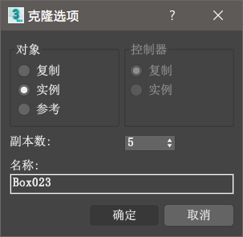
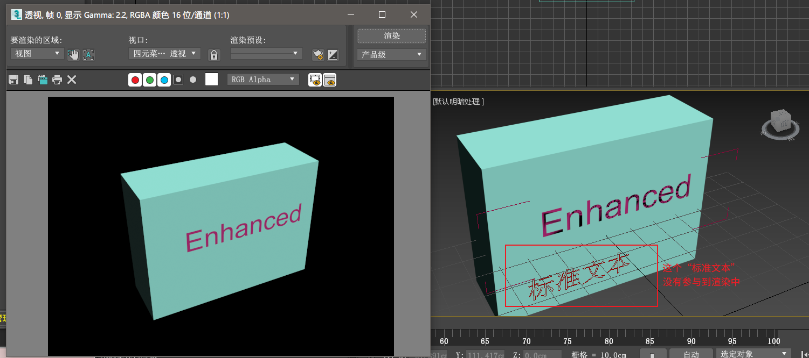
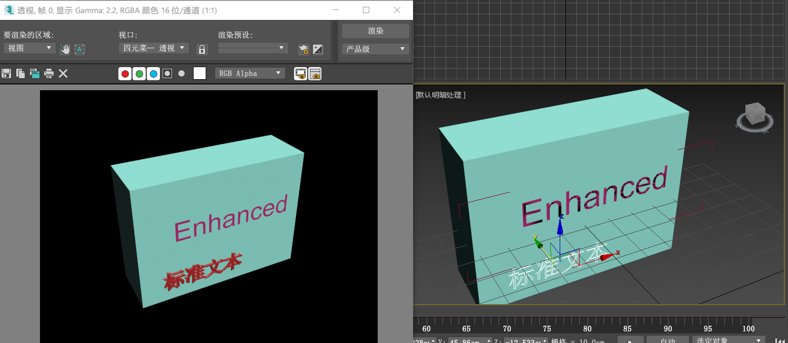

# 第三章 建模方法与分类

## 建模方法综述

### 堆砌建模

用来建造非曲面物体（建筑模型、机械、机器零件等）。

流程大体如下：

1. 将一复杂的物体拆分为一些基础的零部件；
2. 使用基础的成型命令做好这些小零件；
3. 拼接起来！

该方式使用的一些工具：挤出、车削、倒角、FFD 变形工具，etc…

### 细分建模

编辑多边形建模或编辑网格。

流程大体如下：

1. 用基本几何体先完成几何体的大致形状；
2. 使用编辑多边形、编辑网格的方法处理细节。

该方法使用的一些工具：编辑网格、编辑多边形、对称、网格平滑，etc…

## 建模方式分类

### Polygon

### NURBS

### Patch

>*以后再写。*

## 使用 3ds Max 进行基础建模

>*先暂且🕊着*

## 实例：手推车

> 请使用 3ds Max 2017 来打开 `assets/cart.max`。
> 这是一个很典型的堆砌建模。下面会讲到一些需要注意的点。

### 复制对象

按住 `Shift` 键后执行平移、旋转操作时可以复制对象。旋转到位之后会弹出下图所示的对话框：
  

  
在【对象】中的一些选项：
  
* 复制、实例：复制出的物体与原物体的修改参数关联，修改其中一个，其他也会跟随着修改。
* 参考：复制出原物体的参考物体，原物体修改时参照物体也会跟着修改，但是参照物体修改时不影响原物体。（这里和上面所说的修改应该是指在【修改】面板中应用的改动，**而不是工具栏上的缩放命令以及物体的颜色修改**，是我误会了）

## 实例：钟表

> 请使用 3ds Max 2017 来打开 `assets/clock.max`。

### 改变物体轴心点位置

>#### 轴心点是什么？
>参看[第二章](https://whatever)中的相关内容。

选择物体，进入【层次】面板，选中【仅影响轴】、【仅影响对象】都可以。选中前者，就只能移动那个轴心点；选中后者，就只能移动对象。

这个实例中，建议使用对齐工具将轴心点固定好，再使用【仅影响对象】。

### 图形（二维）的渲染

默认情况下，二维图形是不参与渲染的。

要让它参与到渲染中，需要选中二维图形，进入【修改】面板，并勾选【渲染】-【在渲染中启用】

属于“几何体”的【增强型文本】当然会参与渲染。

## #eof