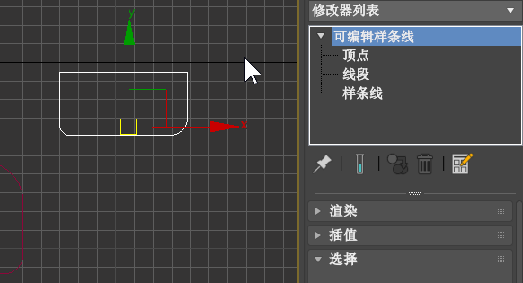

# 第四章 初级建模 - 修改建模

3ds Max 提供了一定的基本模型物体，但是这些物体无法满足模型世界“千变万化的要求”。修改建模应运而生。

本章大部分内容会聚焦在【修改】面板上。

## 修改二维几何体

### 编辑样条线修改器（Edit Spline）

> #### 什么是样条线？
> 所谓样条曲线(Spline Curves)是指给定一组控制点而得到的一条曲线，曲线的大致形状由这些点予以控制。[百度百科][bdlink]

【编辑样条线】的进入方式有两种：
1. 选中一个二维曲线物体，进入【修改】面板，在修改命令下拉框中选择【编辑样条线】；
2. 选中一个二维曲线物体，右键单击，选择【转换为可编辑样条线】。

注意：
- 只有第一种方式能保留原始物体的创建参数信息，因为大部分修改器是“叠加”在原物体上的，移除修改器就可以还原。
- 第二种方式会将原物体“转化”为可编辑样条线，因此原始物体不复存在。
- 除此之外，这两者功能完全相同。

进入【编辑样条线】后，有 3 样子物体级别，分别是顶点、线段、样条线。

【编辑样条线】上修改器很多，面板很长，挑一些常用的讲：
- 【附加】：将两个二维物体“合二为一” 
- 【附加多个】：顾名思义。
- 【分离】：将一个包含多个子样条线的样条线分离，需要选中样条线级别。与【附加】的效果相反。
- 【优化】：在两个顶点之间插入新的顶点，需要选中顶点级别。
- 【插入】：与优化相似，不过你可以控制顶点的位置。
- 【焊接】：若直线两端是断开的，此命令会将其闭合。需要选中顶点级别。
- 【圆角】：将一个顶点转为圆角。需要选中顶点级别。
- 【切角】：
- 【轮廓】：将样条线向内/外复制。需要选中样条线级别。
- 【布尔】：将……

## 实践：制作 GitHub Logo

> 参照 `assets/github.max`。

使用下图为基准，来制作一个立体的 GitHub Logo。

已知这张图片的分辨率是 1024 * 1024，因此我们在 3ds Max 中新建一个平面，手动输入满足 1:1 的大小。

### 初探材质编辑器

打开【材质编辑器】，选择一个材质球，在【漫反射】之后的贴图选项中选择【位图】，并加载上面这张图片。视口中选中目标平面，点选【将材质指定给指定对象】，就设置好了。

这个平面就会作为接下来画图的参考。

### 用样条线描摹

先创建一个与外部轮廓相切的圆。

然后不勾选【开始新图形】，使用【创建】-【线】在重要的转折点上标出个轮廓。这根样条线会与之前创建的圆一起组成一个样条线。

选中轮廓上的所有点，右键 - 【Bezier 角点】，更改这些顶点的属性。改完之后，顶点会出现图示的绿色手柄。

之后使用【选择并移动】工具移动绿色手柄，使曲线与平面上的图形贴合，最后成果：

### 挤出为三维物体

给最终的样条线添加【挤出】修改器。并设置挤出数量。

## 修改三维几何体

### 弯曲

*之后再写吧*

[bdlink]: https://baike.baidu.com/item/%E6%A0%B7%E6%9D%A1%E6%9B%B2%E7%BA%BF